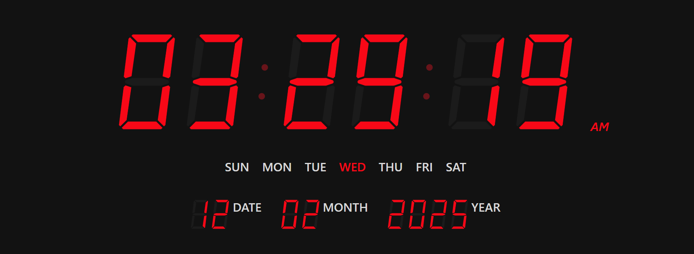

# LED Digital Clock ⏰

A sleek and modern **LED Digital Clock** built using **React (TypeScript) + Tailwind CSS**. This project simulates a classic 7-segment digital clock with a futuristic dark mode UI. It displays **time, date, and day of the week** dynamically.

## 🚀 Features

✅ Real-time digital clock display (HH:MM:SS AM/PM)  
✅ Shows the current **day of the week**  
✅ Displays **date, month, and year**  
✅ Uses **7-segment LED style** for an authentic look  
✅ Built with **React (TypeScript) + Tailwind CSS**  
✅ Fully **responsive** for various screen sizes  
✅ Smooth animations and modern design

## 🛠️ Tech Stack

- **React.js** (TypeScript) - Component-based UI
- **Tailwind CSS** - Fast and modern styling
- **JavaScript Date API** - Fetches real-time data

## 🤝 Contributing

We welcome contributions! Check out the [CONTRIBUTING.md](CONTRIBUTING.md) file for details.

## 📜 License

This project is licensed under the MIT License. Feel free to use and modify it.

## ⭐ Show Your Support

If you like this project, please ⭐ star the repo and share it! 🚀

## 🔗 Follow me on GitHub: [Github Profile](https://github.com/sshuvoo)
